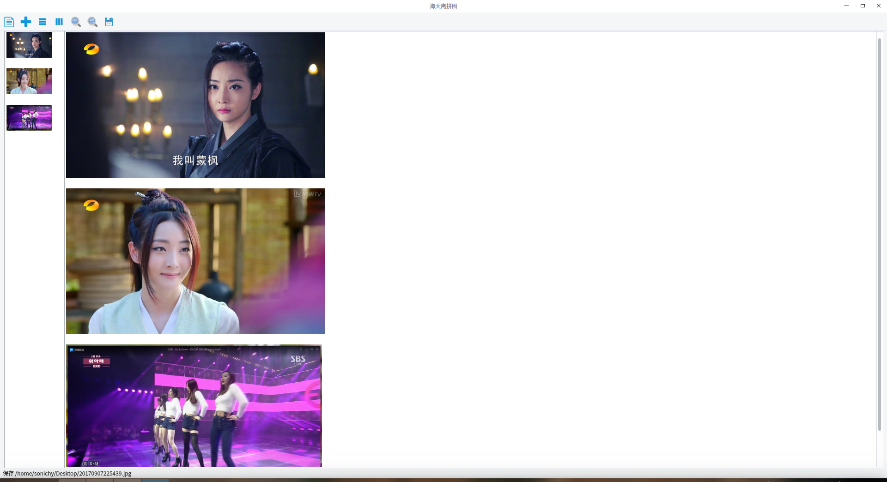

# Qt 海天鹰拼图
基于 Qt 的拼图程序，横向或竖向排列，保存拼图。  
已编译好的 HTYPinTu 程序适用 64 位 Linux 系统 Qt5 环境，双击运行，其他版本自行编译。  

  

### 2.3
* 增加：左侧图标列表拖放排序（DragDropMode(QAbstractItemView::InternalMove) + ViewMode::ListMode(default)）。
* 增加：支持多个文件拖放打开。
* 增加：只能添加图片。
* 修复：最大宽(高)度计算错误。
### 2.2
* 增加：图片按小图或大图缩放。
### 2.1
* 竖排按最大宽度保存，横排按最大高度保存。
### 2.0
* 图片阵列并保存图片，DIY寸照冲印不再难。  
### 1.0
* 横向排列并保存图片，纵向排列并保存图片。

### 问题
* 适应大图还没做。